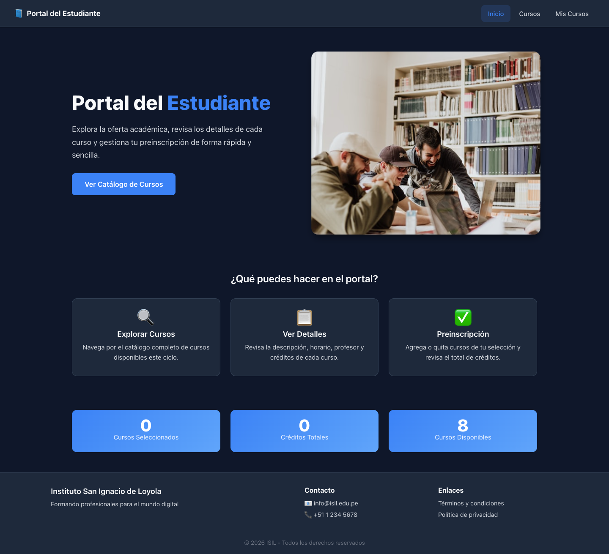
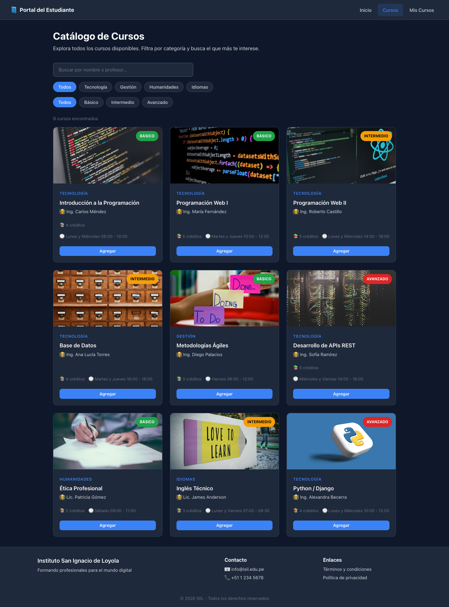
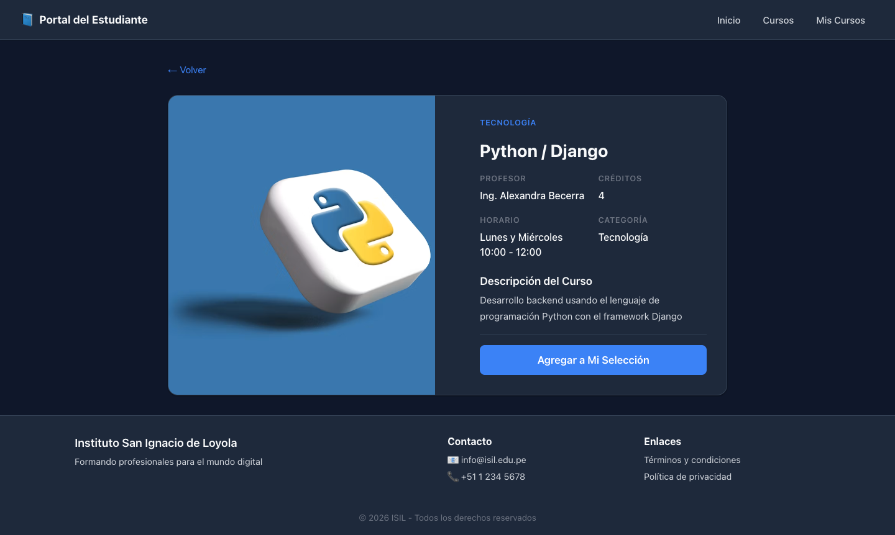
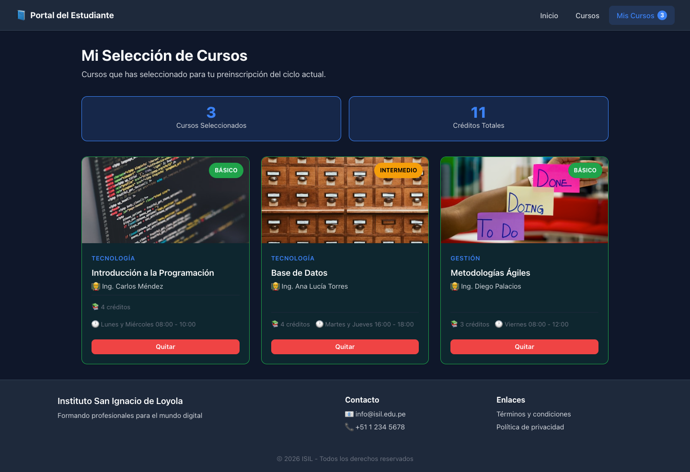

# Portal del Estudiante - ISIL

Aplicación SPA en React para el sistema de "Gestión de Cursos e Inscripciones" del Instituto San Ignacio de Loyola.

## 📋 Descripción

Portal del Estudiante es una Single Page Application (SPA) construida con React que permite a los estudiantes:

- 🔍 Explorar el catálogo completo de cursos disponibles
- 📖 Ver detalles de cada curso (descripción, profesor, horario, créditos)
- ✅ Agregar y quitar cursos de una selección de preinscripción
- 📊 Visualizar el total de créditos acumulados
- 🔎 Filtrar cursos por categoría y buscar por nombre o profesor

## 🛠️ Tecnologías Utilizadas

- **React 19** - Biblioteca para construir interfaces de usuario
- **Vite** - Herramienta de compilación y desarrollo rápida
- **React Router DOM 7** - Navegación SPA sin recarga de página
- **Context API** - Gestión de estado global
- **Hooks** - useState, useEffect, useCallback, useContext, useParams
- **CSS3** - Estilos responsivos con variables CSS y diseño adaptable

## 📁 Estructura del Proyecto

```
src/
├── components/        # Componentes funcionales reutilizables
│   ├── Button.jsx     # Botón reutilizable con variantes y tamaños
│   ├── CourseCard.jsx # Tarjeta de curso con acciones de selección
│   ├── CourseList.jsx # Lista adaptable de tarjetas de cursos
│   ├── Footer.jsx     # Pie de página institucional
│   └── Navbar.jsx     # Barra de navegación con indicador de selección
├── pages/             # Páginas/vistas principales
│   ├── Home.jsx       # Página de inicio con resumen y acceso rápido
│   ├── Courses.jsx    # Catálogo con filtros y búsqueda
│   ├── CourseDetail.jsx # Detalle completo de un curso
│   ├── MyCourses.jsx  # Cursos seleccionados por el estudiante
│   └── NotFound.jsx   # Página de error 404
├── routes/
│   └── AppRoutes.jsx  # Configuración de rutas y layout
├── context/
│   └── CourseContext.jsx # Context API + Provider + Hook personalizado
├── data/
│   └── courses.js     # Datos mock del catálogo de cursos
├── App.jsx            # Componente raíz con Provider
├── main.jsx           # Punto de entrada con BrowserRouter
├── index.css          # Estilos globales y responsive
└── App.css            # Estilos adicionales
```

## 🚀 Instalación y Ejecución

### Requisitos previos

- Node.js 18 o superior
- npm 9 o superior

### Instalación

```bash
# Clonar el repositorio
git clone <url-del-repositorio>
cd PA3---Programacion-Web

# Instalar dependencias
npm install
```

### Ejecución en desarrollo

```bash
npm run dev
```

La aplicación estará disponible en `http://localhost:5173`

### Compilación para producción

```bash
npm run build
```

### Vista previa de producción

```bash
npm run preview
```

## 🔄 Flujo de Navegación

1. **Inicio** (`/`) - Página de bienvenida con acceso rápido al catálogo y resumen de selección
2. **Catálogo** (`/courses`) - Lista de todos los cursos con filtros por categoría y búsqueda
3. **Detalle** (`/course/:id`) - Información completa del curso con opción de agregar/quitar
4. **Mis Cursos** (`/mycourses`) - Cursos seleccionados con total de créditos
5. **Error 404** - Página de error para rutas no existentes

Toda la navegación es fluida, sin recarga de página (SPA), gracias a React Router.

## 🧠 Manejo de Estado

El estado global se gestiona mediante **Context API** a través de `CourseContext`:

- **Estado**: Lista de IDs de cursos seleccionados
- **Persistencia**: Los cursos seleccionados se guardan en `localStorage`
- **Acciones**: `addCourse`, `removeCourse`, `isEnrolled`
- **Datos derivados**: `enrolledCourses` (objetos completos), `totalCredits` (suma de créditos)

Esto permite que cualquier componente pueda acceder y modificar la selección sin necesidad de pasar props manualmente.

## 👥 Integrantes

| Integrante                    | Rol / Aporte        |
| ----------------------------- | ------------------- |
| Mario Yonatan Haro Agreda     | Desarrollo frontend |
| Karlo Andre Vergara Caballero | Desarrollo frontend |
| Alexis Chagua Cueva           | Desarrollo backend  |
| Erick Borda Roman             | Desarrollo frontend |
| Christopher Lenin Cano Romero | Desarrollo backend  |

## 📸 Capturas de Pantalla

**/home**!


**/courses**


**/courses/id**


**/mycourses**


## 📹 Link de Exposición en YouTube

[https://youtu.be/qqcUu4xESuk](https://youtu.be/qqcUu4xESuk "link")
