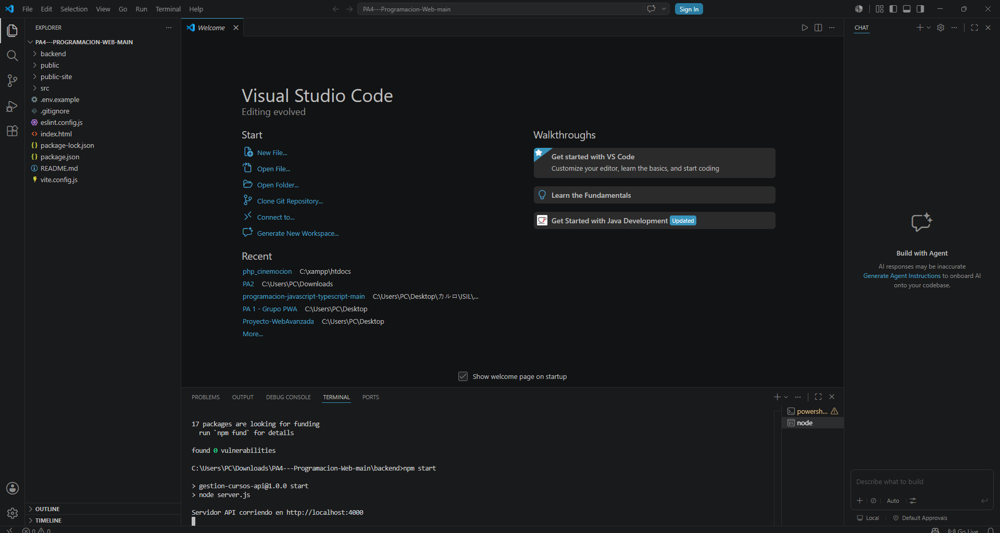
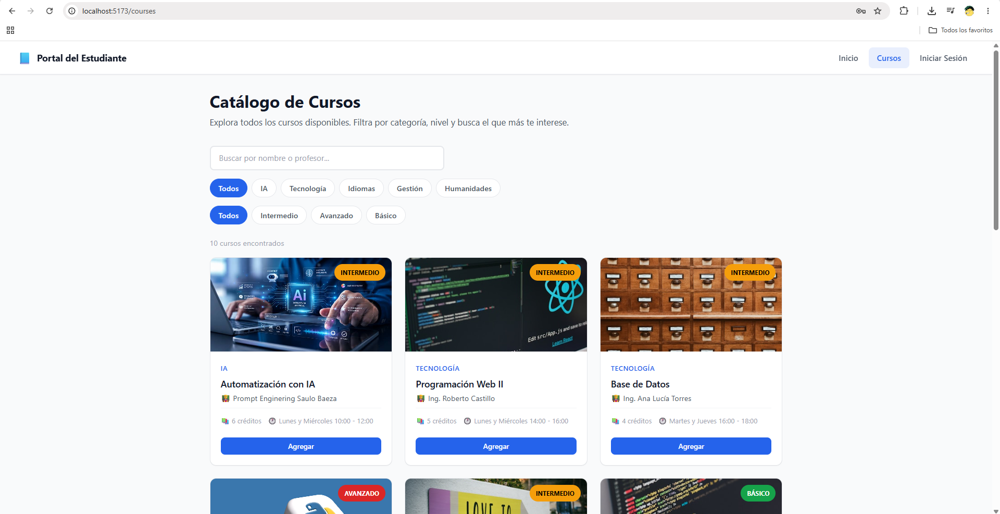
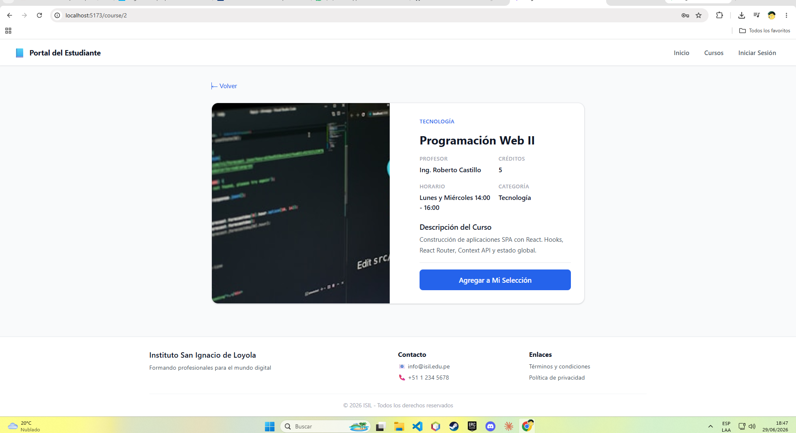
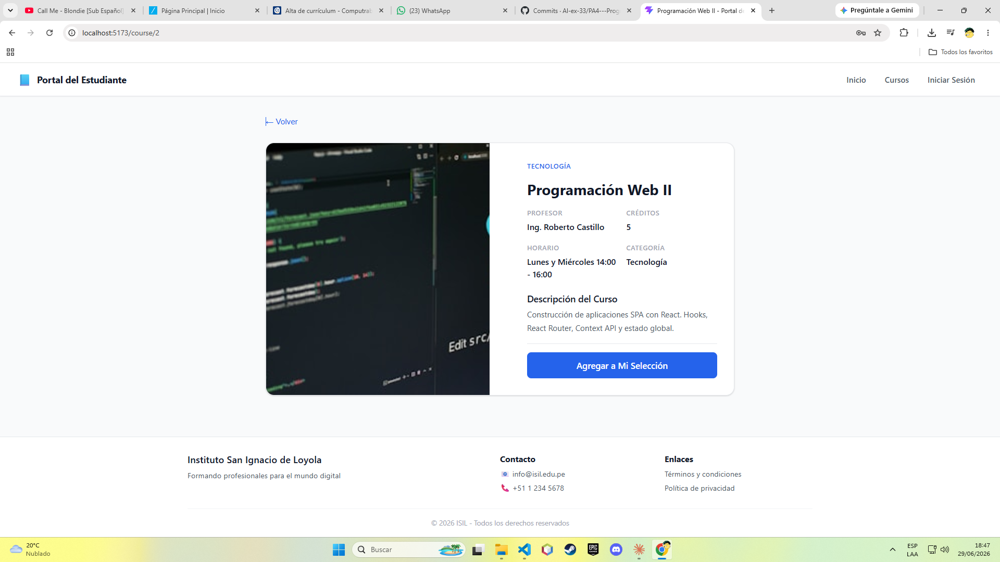
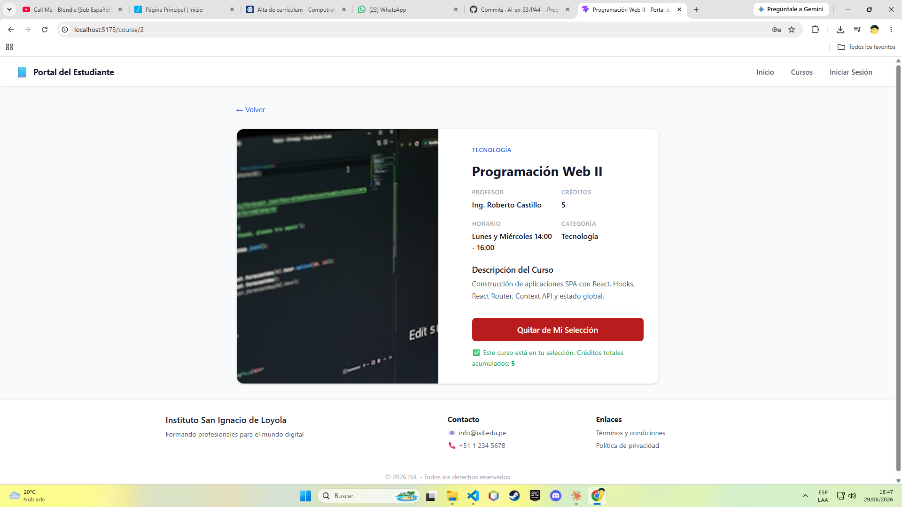
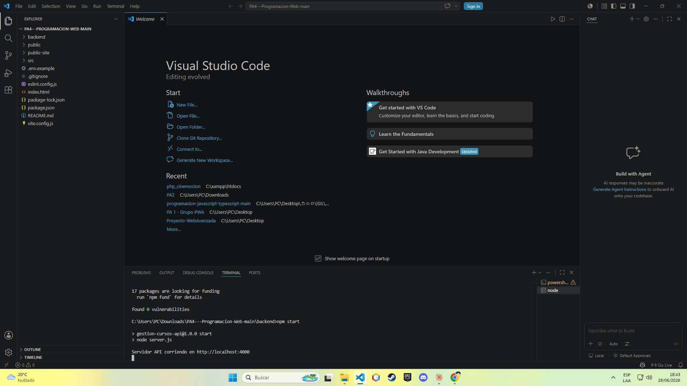

# 📚 Gestión de Cursos e Inscripciones - Experiencia Integrada (PA4)

## 📖 Descripción del proyecto

Este proyecto corresponde a la **Práctica de Aprendizaje 4 (PA4)** del curso **Programación Web Avanzada** del Instituto San Ignacio de Loyola (ISIL).

La solución implementa un sistema denominado **"Gestión de Cursos e Inscripciones - Experiencia Integrada"**, compuesto por un **Portal del Estudiante desarrollado en React**, una **API REST construida con Express.js**, autenticación mediante **JSON Web Token (JWT)** y un **módulo público desarrollado con Next.js**.

El sistema permite a los estudiantes autenticarse, consultar la oferta académica, visualizar el detalle de los cursos, gestionar sus inscripciones y mantener una sesión segura mediante tokens de autenticación.

---

# 🎯 Objetivos

* Implementar una aplicación React conectada a una API REST.
* Gestionar autenticación utilizando JWT.
* Proteger rutas privadas mediante manejo de sesión.
* Desarrollar un módulo público utilizando Next.js.
* Preparar la aplicación para un entorno de producción.
* Documentar el proyecto siguiendo buenas prácticas de desarrollo.

---

# 🛠 Tecnologías utilizadas

## Frontend

* React
* Vite
* React Router DOM
* Axios
* CSS

## Backend

* Node.js
* Express.js
* JSON Web Token (JWT)

## Módulo Público

* Next.js

## Control de versiones

* Git
* GitHub

---

# 🏗 Arquitectura del proyecto

```text
PA4---Programacion-Web
│
├── backend/
│   ├── routes/
│   ├── middleware/
│   ├── data/
│   └── server.js
│
├── public-site/
│   ├── app/
│   ├── components/
│   └── public/
│
├── src/
│   ├── components/
│   ├── context/
│   ├── pages/
│   ├── services/
│   └── router/
│
└── README.md
```

---

# ✨ Funcionalidades implementadas

### Portal del Estudiante (React)

* Inicio de sesión.
* Consumo de datos desde la API REST.
* Listado de cursos disponibles.
* Visualización del detalle de cada curso.
* Inscripción y cancelación de inscripción.
* Visualización de cursos inscritos.
* Protección de rutas privadas.
* Cierre de sesión.

---

### Backend (Express)

* API REST.
* Autenticación mediante JWT.
* Validación de usuarios.
* Endpoints protegidos.
* Gestión de cursos.
* Gestión de inscripciones.

---

### Módulo Público (Next.js)

* Página principal.
* Catálogo de cursos.
* Ruta dinámica para visualizar el detalle de cada curso.
* Navegación pública para visitantes.

---

# 🔐 Manejo de autenticación

La autenticación se realiza utilizando **JSON Web Token (JWT)**.

Después de iniciar sesión correctamente:

* El servidor genera un token.
* El token es almacenado en el cliente.
* Las rutas protegidas verifican la autenticidad del token.
* El usuario puede cerrar sesión eliminando el token almacenado.

---

# 🌐 Consumo de API

La aplicación React consume la API REST utilizando Axios.

Entre los principales endpoints utilizados se encuentran:

* Inicio de sesión.
* Obtención de cursos.
* Consulta del detalle de un curso.
* Consulta de cursos inscritos.
* Inscripción en un curso.
* Cancelación de inscripción.

---

# 🌍 Módulo público con Next.js

El proyecto incorpora un módulo desarrollado con **Next.js**, el cual permite que visitantes no autenticados puedan consultar información pública sobre la oferta académica.

Se implementan:

* Página principal.
* Catálogo de cursos.
* Ruta dinámica para visualizar información individual de cada curso.

---

# 🏭 Preparación para producción

El proyecto fue preparado para un entorno de producción mediante:

* Variables de entorno.
* Scripts de construcción (build).
* Organización modular del código.
* Separación entre frontend, backend y módulo público.
* Configuración para despliegue.

El proyecto genera correctamente los builds de React y Next.js sin errores críticos.

---

# ⚙ Requisitos

* Node.js 20 o superior
* npm
* Git

---

# 🚀 Instalación

Clonar el repositorio:

```bash
git clone https://github.com/Al-ex-33/PA4---Programacion-Web.git
```

Ingresar al proyecto:

```bash
cd PA4---Programacion-Web
```

Instalar dependencias del proyecto principal:

```bash
npm install
```

Instalar dependencias del backend:

```bash
cd backend
npm install
```

Instalar dependencias del módulo público:

```bash
cd ../public-site
npm install
```

---

# ▶ Ejecución

## React

```bash
npm run dev
```

---

## Backend

```bash
cd backend
npm run dev
```

---

## Next.js

```bash
cd public-site
npm run dev
```

---

# 🌐 Variables de entorno

## Frontend

Archivo:

```text
.env
```

Contenido:

```env
VITE_API_URL=http://localhost:4000/api
```

---

## Backend

Archivo:

```text
backend/.env
```

Variables:

```env
PORT=4000
JWT_SECRET=********
JWT_EXPIRES_IN=2h
FRONTEND_URL=http://localhost:5173
NEXTJS_URL=http://localhost:3000
```

---

# 📸 Evidencias

### Página de inicio - Portal del Estudiante


### Página de inicio - Resumen de actividad


### Catálogo de cursos


### Detalle de curso


### Mis cursos - Curso agregado a selección


### Servidor de desarrollo React (Vite) corriendo


### Backend Express corriendo


---

# 👥 Integrantes

* Mario Yonatan Haro Agreda
* Karlo Andre Vergara Caballero
* Alexis Chagua Cueva
* Erick Borda Roman
* Christopher Lenin Cano Romero

---

# 🎥 Video de sustentación

**Enlace del video de YouTube:**

> https://youtu.be/H2hQYECBTEc

---

# 🔗 Repositorio

https://github.com/Al-ex-33/PA4---Programacion-Web

---

# 📌 Conclusiones

Durante el desarrollo de este proyecto se integraron los conocimientos adquiridos en el curso de Programación Web II, aplicando el consumo de APIs REST, autenticación mediante JWT, protección de rutas, desarrollo de interfaces con React, construcción de un módulo público con Next.js y preparación del sistema para un entorno de producción.

El resultado obtenido es una solución funcional, organizada y documentada, siguiendo buenas prácticas de desarrollo web moderno.
