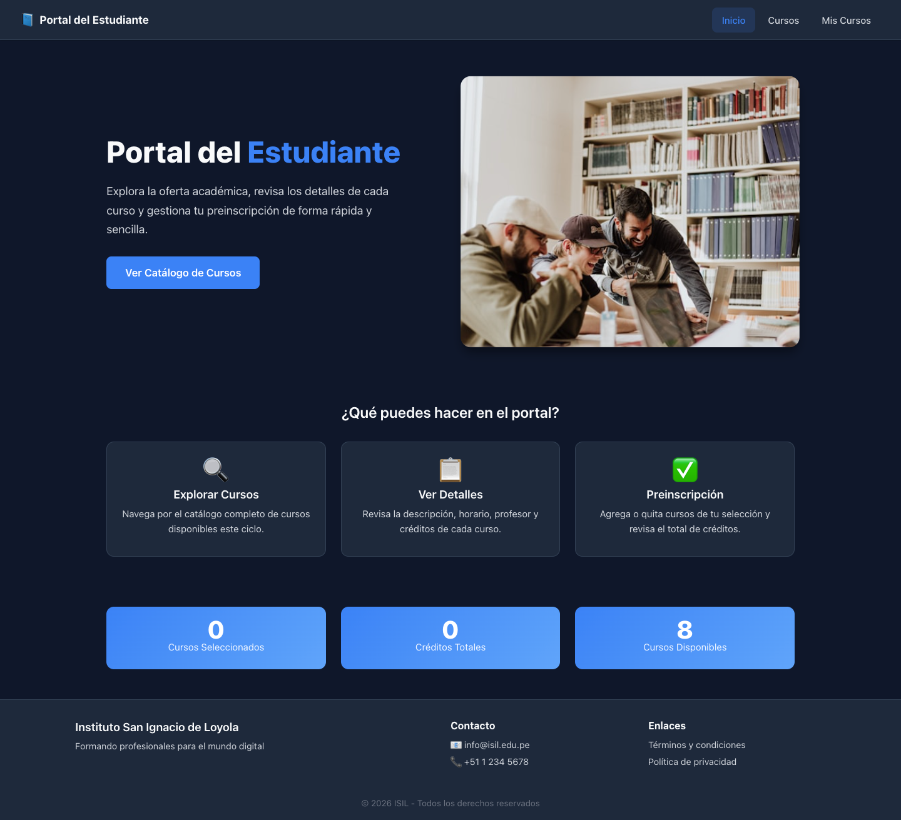
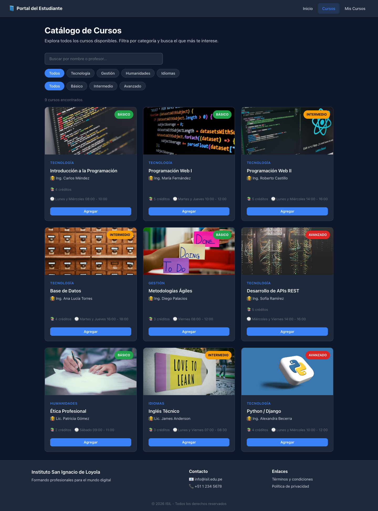
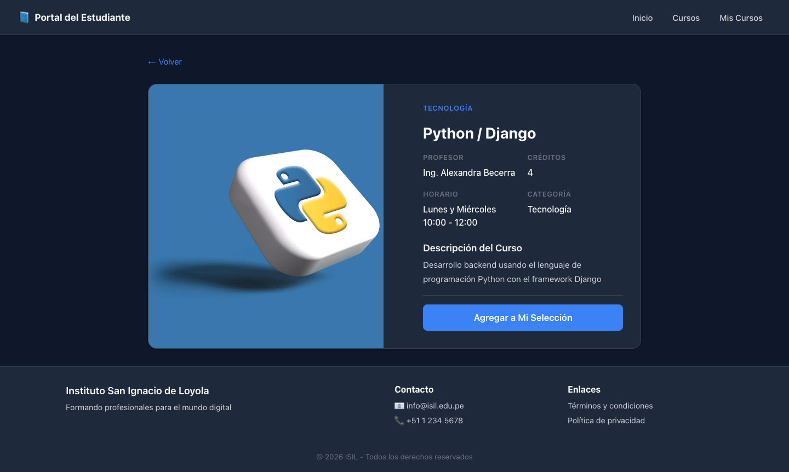
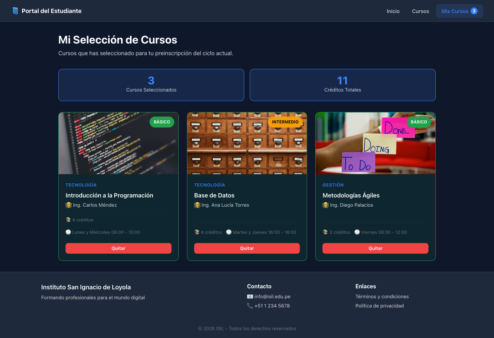

# Gestión de Cursos e Inscripciones - Experiencia Integrada

Solución compuesta por un **Portal del Estudiante en React** con autenticación JWT, una **API REST en Express** y un **módulo público en Next.js** con SSG.

## 📋 Descripción

El sistema permite a los estudiantes:

- 🔐 Iniciar sesión con autenticación JWT
- 🔍 Explorar el catálogo completo de cursos (desde API REST)
- 📖 Ver detalles de cada curso con información de cupos
- ✅ Inscribirse y cancelar inscripción a cursos (vía API)
- 📊 Visualizar el total de créditos acumulados
- 🌐 Módulo público en Next.js con catálogo accesible sin autenticación
- 🔎 Filtrar por categoría, nivel y búsqueda textual

## 🛠️ Tecnologías Utilizadas

| Capa | Tecnología |
|------|-----------|
| **Frontend (Portal)** | React 19 + Vite + React Router DOM 7 |
| **Backend API** | Node.js + Express + JWT + bcryptjs |
| **Módulo Público** | Next.js 14 (SSG/ISR + rutas dinámicas) |
| **HTTP Client** | Axios con interceptores |
| **Estado Global** | Context API (AuthContext + CourseContext) |
| **Estilos** | CSS3 con variables, dark mode, responsive |
| **Autenticación** | JWT almacenado en localStorage con interceptores |

## 📁 Estructura del Proyecto

```
├── backend/                # API REST con Express + JWT
│   ├── server.js           # Servidor principal
│   ├── routes/
│   │   ├── auth.js         # POST /login, GET /me
│   │   └── courses.js      # CRUD cursos + enroll
│   ├── middleware/
│   │   └── auth.js         # Middleware JWT
│   ├── data/
│   │   ├── courses.js      # Datos de cursos (8)
│   │   └── users.js        # Usuarios mock
│   ├── .env.example
│   └── package.json
├── src/                    # React - Portal del Estudiante
│   ├── components/         # Button, Navbar, Footer, CourseCard, CourseList
│   ├── pages/              # Home, Login, Courses, CourseDetail, MyCourses, NotFound
│   ├── routes/             # AppRoutes + ProtectedRoute
│   ├── context/            # AuthContext + CourseContext
│   ├── services/
│   │   └── api.js          # Axios config + JWT interceptors
│   ├── App.jsx             # AuthProvider + CourseProvider
│   ├── main.jsx            # BrowserRouter entry
│   └── index.css           # Estilos globales
├── public-site/            # Next.js - Módulo público
│   ├── pages/
│   │   ├── index.jsx       # Inicio público (SSG + ISR)
│   │   ├── courses/[id].jsx # Detalle dinámico (SSG + ISR)
│   │   └── _app.jsx
│   ├── styles/globals.css
│   ├── next.config.js
│   ├── .env.example
│   └── package.json
├── .env.example            # Variables de entorno (frontend)
├── README.md
└── package.json
```

## 🚀 Instalación y Ejecución

### Requisitos previos

- Node.js 18 o superior
- npm 9 o superior

### 1. Clonar e instalar dependencias

```bash
git clone <url-del-repositorio>
cd PA3---Programacion-Web

# Frontend React
npm install

# Backend API
cd backend && npm install && cd ..

# Módulo público Next.js
cd public-site && npm install && cd ..
```

### 2. Configurar variables de entorno

```bash
# Frontend (.env)
cp .env.example .env
# Editar VITE_API_URL si es necesario (default: http://localhost:4000/api)

# Backend
cp backend/.env.example backend/.env
# JWT_SECRET, JWT_EXPIRES_IN, FRONTEND_URL, NEXTJS_URL

# Next.js
cp public-site/.env.example public-site/.env
# API_URL
```

### 3. Ejecutar en desarrollo

```bash
# Terminal 1: Backend API (puerto 4000)
cd backend && npm run dev

# Terminal 2: Frontend React (puerto 5173)
npm run dev

# Terminal 3: Módulo público Next.js (puerto 3000)
cd public-site && npm run dev
```

### 4. Build de producción

```bash
# Backend
cd backend && npm start

# Frontend React
npm run build

# Next.js
cd public-site && npm run build
```

## 🔄 Flujo de Navegación

### Portal del Estudiante (React - requiere login)

1. **Login** (`/login`) - Inicio de sesión con JWT. Credenciales demo: `estudiante@isil.pe` / `123456`
2. **Inicio** (`/`) - Bienvenida con resumen de selección
3. **Catálogo** (`/courses`) - Cursos desde API con filtros y búsqueda
4. **Detalle** (`/course/:id`) - Información completa + inscripción
5. **Mis Cursos** (`/mycourses`) - Ruta protegida, cursos inscritos
6. **Cerrar Sesión** - Botón "Salir" que elimina token y redirige

### Módulo Público (Next.js - sin autenticación)

1. **Inicio** (`/`) - Catálogo público con SSG (regeneración cada 60s)
2. **Detalle** (`/courses/[id]`) - Página dinámica pre-renderizada con SSG

## 🔐 Autenticación y Seguridad

- **Flujo**: POST `/api/auth/login` → recibe JWT → almacenado en `localStorage`
- **Interceptores**: Axios agrega `Authorization: Bearer <token>` automáticamente
- **Token expirado**: Interceptor detecta 401/403, limpia storage y redirige a `/login`
- **Rutas protegidas**: `<ProtectedRoute>` redirige a `/login` si no hay sesión
- **Cierre de sesión**: Elimina token y usuario de localStorage, actualiza estado global

## 🧠 Manejo de Estado

| Contexto | Responsabilidad |
|----------|----------------|
| **AuthContext** | Usuario, token, login(), logout(), isAuthenticated, loading, error |
| **CourseContext** | Cursos (desde API), enrolledIds, addCourse(), removeCourse(), isEnrolled(), totalCredits |

Ambos usan Context API + hooks personalizados (`useAuth`, `useCourses`).

## 🌐 Variables de Entorno

| Variable | Descripción | Default |
|----------|-------------|---------|
| `VITE_API_URL` | URL de la API REST | `http://localhost:4000/api` |
| `PORT` | Puerto del backend | `4000` |
| `JWT_SECRET` | Clave secreta para firmar tokens | (requerido) |
| `JWT_EXPIRES_IN` | Duración del token | `2h` |
| `FRONTEND_URL` | URL del frontend React (CORS) | `http://localhost:5173` |
| `NEXTJS_URL` | URL del módulo Next.js (CORS) | `http://localhost:3000` |
| `API_URL` | URL de API (usado por Next.js) | `http://localhost:4000/api` |

## 📡 Endpoints de la API

| Método | Ruta | Auth | Descripción |
|--------|------|------|-------------|
| POST | `/api/auth/login` | No | Iniciar sesión, retorna JWT |
| GET | `/api/auth/me` | JWT | Datos del usuario autenticado |
| GET | `/api/courses` | No | Listar todos los cursos |
| GET | `/api/courses/:id` | No | Detalle de un curso |
| POST | `/api/courses/:id/enroll` | JWT | Inscribirse a un curso |
| DELETE | `/api/courses/:id/enroll` | JWT | Cancelar inscripción |
| GET | `/api/courses/my/enrolled` | JWT | Cursos del estudiante |
| GET | `/api/health` | No | Health check |

## 👥 Integrantes

| Integrante                    | Rol / Aporte        |
| ----------------------------- | ------------------- |
| Mario Yonatan Haro Agreda     | Desarrollo frontend |
| Karlo Andre Vergara Caballero | Desarrollo frontend |
| Alexis Chagua Cueva           | Desarrollo backend  |
| Erick Borda Roman             | Desarrollo frontend |
| Christopher Lenin Cano Romero | Desarrollo backend  |

## 📸 Capturas de Pantalla

**/home**!


**/courses**


**/courses/id**


**/mycourses**


## 📹 Link de Exposición en YouTube

[https://youtu.be/qqcUu4xESuk](https://youtu.be/qqcUu4xESuk "link")
